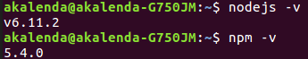
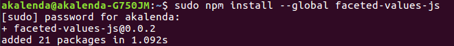
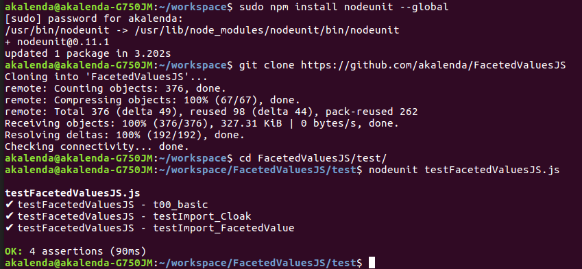
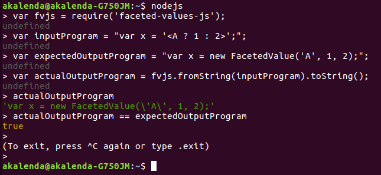
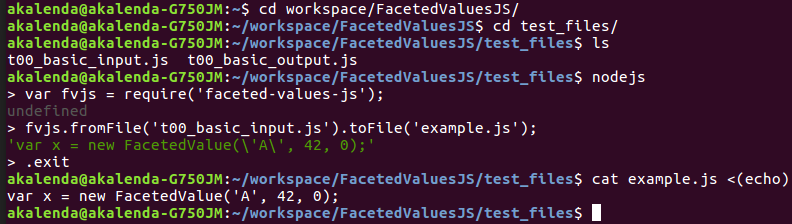

# FacetedValuesJS

* auto-gen TOC:
{:toc}

This is a NodeJS module that rewrites JavaScript programs intended
for cybersecurity purposes. The motivation for its use is to 
mitigate the damage done by, for example, cross-site scripting 
attacks through the use of "faceted values."

## Getting Started

Although our example commands demonstrate the process in Ubuntu, any
operating system (Linux, Windows, OS X) will work.

### Installation

Make sure [NodeJS](https://nodejs.org/) 
and [NPM](https://github.com/npm/npm) are installed:

Use NPM to install our `faceted-values-js` module. You can install it locally
to a specific package you are working on by including a 
[package.json](https://docs.npmjs.com/files/package.json) in your workspace, or
you can install it globally. The following screenshot demonstrates a global
install on Ubuntu Linux:

    
Although not strictly necessary for an end-user, the NPM module
[nodeunit](https://github.com/caolan/nodeunit)
may be useful. Our unit tests show the library in action, and running them
oneself can help with troubleshooting. As noted in the documentation, installing
nodeunit globally allows it to be used from the command line. The NPM module does
not include these unit test files, but they can be found in the repository:

    
### Using the library

Here is a screenshot of a simple usage performed through the NodeJS REPL:

    
However, this is not a practical way to use faceted values. Typically one would write
a complete program to a `.js` file, and then have our API rewrite the program to a new
source file that is then used:

    
## API Overview

## Development

### Versioning

[Semantic versioning](http://semver.org/) has much to be studied, but 
at the moment the repository follows this basic outline 
[courtesy of Evan Hahn](https://evanhahn.com/make-an-npm-baby/):

- There are three positive integers, A.B.C. 
- Increment C when you fix bugs. 
- Increment B when you add features but don't break old code. 
- Increment A when you'll break old code. 
- When A is 0, there are no rules.
